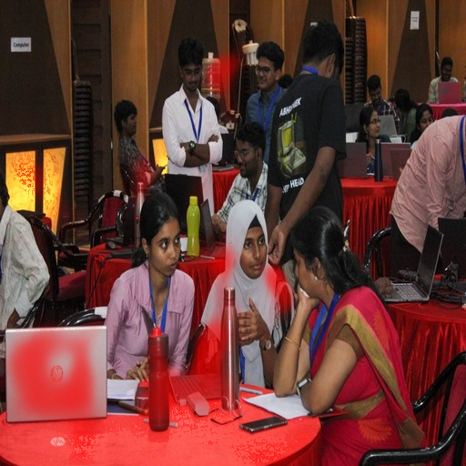

# Multi-Level Deepfake Detection

A three-class image detector: **Real / AI-Generated / AI-Edited**, with a
Streamlit UI that shows where it thinks an edit is and says "cannot tell" when
it is not sure.

The first version reached ~89% on its own test set. **That number measured which
dataset a file came from, not what was in the image**, and the first half of this
README is how I established that. The second half is the rebuild on data where
that shortcut does not exist: 80.4% in-distribution, 72.3% mean recall on
generators it never saw, eight levers tested along the way, and the photo of my
own that it still gets wrong.

I started this because generative models have made it genuinely hard to know
whether you can believe something you're looking at, and because a friend of mine
ran into real trouble from generative AI being used maliciously. I wanted
something that could tell the difference.

---

## ⚠️ Status

**The original models in this repository do not detect AI-generated content. They
recognise which source dataset an image came from.** That is established below
with measurements rather than asserted.

The rebuild on a corpus verified to carry no such shortcut is in
[The rebuild](#the-rebuild). The first honest number was **65.8%** against the
original 89%, and the gap between those two figures is the whole point of the
project. The final model, a CLIP ViT-B/16 mask head, reaches **80.4%** on the same
clean data, still below the original's headline and worth more than it. It says
"cannot tell" when unsure, and the first photo of mine I gave it was one of
those: see [The test that started this](#the-test-that-started-this).

- Full limitations, for both models: **[`LIMITATIONS.md`](LIMITATIONS.md)**
- Audit trail: [`docs/REVIEW_2026-09-08.md`](docs/REVIEW_2026-09-08.md) ·
  [`docs/DATASET_BUILDER_AUDIT.md`](docs/DATASET_BUILDER_AUDIT.md)
- Dataset survey and confound measurements: [`docs/DATASETS_2026.md`](docs/DATASETS_2026.md)
- Plan: [`docs/SALVAGE_PLAN.md`](docs/SALVAGE_PLAN.md)

---

## What this project found

All twenty source corpora map to exactly one class each — every "real" image comes
from a photo dataset, every "AI-generated" one from a generator dump, every
"edited" one from a forgery benchmark. Source→class purity is **100.0%**. That
makes corpus identity a perfect stand-in for the label, and it is far easier to
learn than a manipulation trace.

I did not set out to find this. I had finished training and was writing the
documentation, and I wanted to try the model on some of my own photographs before
calling it done. It got them wrong — confidently. Everything below is what I did
to work out why.

### 1. The file header beats the network

A lookup table on `(format, width, height)`, fit on train and scored on test,
**reading no pixels at all**:

| Feature | 3-class test accuracy |
|---|---|
| majority-class baseline | 33.40% |
| container format alone | 59.11% |
| resolution alone | 79.88% |
| **format + resolution** | **87.40%** |
| the trained model | ~89% |

All 13,905 TIFF files in the dataset are `ai_edited` — 100% precision, 53.8% of
that class, 17.9% of the dataset classified perfectly without decoding an image.

### 2. A routine JPEG re-save inverts the prediction

`P(correct)` over resolution × JPEG quality, on 200 images that are **all
AI-generated**. Content never changes; only the encoding does.

```
  size    no-jpeg     q95     q85     q75     q60
  1024      0.990   0.990   0.985   0.960   0.925
   768      0.995   0.985   0.965   0.950   0.880
   512      0.995   0.990   0.980   0.945   0.675
   384      0.995   0.985   0.935   0.650   0.395
   320      0.995   0.970   0.680   0.380   0.160
   256      0.990   0.675   0.080   0.005   0.000
```

Downscale to 256px and save at q80 — what happens to any image crossing the web —
and **280 of 300 AI-generated images are classified "real" at 87% confidence.**
Accuracy goes 0.993 → 0.027. Resolution alone is harmless (the no-JPEG column);
it is compression artefact scale relative to image size that carries the signal,
because that is the encoding signature separating the `real` corpora from the
generated ones.

### 3. Validation accuracy is inversely correlated with robustness

Across nine runs, Pearson **r = −0.956** between `best_val_acc` and accuracy under
degradation:

| run | augmentation | val acc | accuracy at 256px / q60 |
|---|---|---|---|
| 19 *(the one that shipped)* | light | 0.894 | **0.000** |
| 10 | standard | 0.866 | 0.650 |
| 17 *(rejected)* | strong | 0.843 | **0.955** |

Strong augmentation destroys the corpus fingerprint, so the validation set — which
shares that fingerprint — penalises it. **A robust model was already trained and
was discarded for scoring five points lower on a metric measuring the wrong
thing.**

### 4. The test set is contaminated

Deduplication and cluster-splitting run once per source, so nothing is ever
compared across corpora:

| measure | count | % of test |
|---|---|---|
| test images byte-identical to a train image | 1,012 | **4.34%** |
| test images pHash-identical to a train image | 1,656 | **7.09%** |

Separately, **743 COCO photos appear both as a `real` example and as the base
image of a DEFACTO `ai_edited` example** — DEFACTO filenames embed the COCO ID —
with 616 of those pairs crossing a split boundary.

### 5. No forensic component has a measurable effect

Paired McNemar on the test set (n = 23,341) against plain RGB ConvNeXt-Small:
**+SRM p = 0.725**, +SRM+FFT p = 0.081, "GeM" p = 1.000, "CBAM" p = 0.324. The
measured noise floor, from two runs with identical configs, is **0.15 pp** — larger
than every claimed effect. Two of those four checkpoints also turned out not to
contain the component their folder name claims.

### 6. The `ai_edited` score is too high to be genuine

The model reports 0.86 F1 on `ai_edited`. DEFACTO images average **1.7% tampered
pixels**, and published methods score **0.8–6.9%** on tampered-image detection at
224px while reaching 83–94% on fully-synthetic images. A healthy number here, at
this resolution, is itself evidence of a shortcut.

### What I take from it

The thing that found this was a few minutes of testing on photographs my pipeline
had never touched, and I did it last instead of first. Everything before that —
the ablations, the sweeps, the model cards — was measuring the same flaw more and
more precisely.

The fix is not a better network. Every corpus mapped to exactly one class, so a
shortcut was available and no architecture was going to refuse it. It has to be
fixed in the data: **matched pairs**, where each manipulated image's own original
is its `real` counterpart, so both sides share a camera, a codec and a resolution
and only the manipulation differs. About 11,400 such pairs are recoverable from
filenames already in this dataset — DEFACTO, CASIA and IMD2020 all encode their
source image's ID. That is what the rebuild is built around; see
[`docs/SALVAGE_PLAN.md`](docs/SALVAGE_PLAN.md).

---

## The rebuild

The findings above say what went wrong. This section says what happened when the
same task was attempted on a corpus where the shortcut does not exist.

I did not find the problem by auditing. I found it by doing what I had built the
thing for: I gave the model some photos I had taken myself, and it got most of
them wrong, while it kept getting the dataset images right. The audit came after,
to work out why. Once it was clear that the 89% was measuring where a file came
from, there was nothing to patch. A better architecture or more epochs on that
data would have learned the same shortcut faster. The only fix was data where the
shortcut does not exist, and that meant starting again.

### A dataset where the shortcut is measurably absent

The corpus is a slice of **OpenSDI** (`nebula/OpenSDI_train`), which supplies all
three classes from a single real-image pool with segmentation masks for the
edited class. Its binary label decomposes into the three needed here through the
`key` field, where `entire/` marks a fully synthetic image and `partial/` a
locally edited one.

OpenSDI was not taken on trust. Measured as shipped, on shards holding the same
photographs edited and unedited, the geometry is clean but **the JPEG
quantisation table separates the classes at 93.8%**, because editing requires
re-saving and the editor used 16 distinct quality settings against the originals'
3. That signal is "was this re-encoded by the editor", not a manipulation trace,
and it is intrinsic to any locally-manipulated dataset rather than a defect of
this one.

Re-encoding every image identically removes it. Measured on the converted output,
3600 images across three classes:

| feature | accuracy | over baseline |
|---|---|---|
| majority-class baseline | 49.6% | |
| container format | 49.6% | +0.0 |
| resolution, megapixels, aspect ratio | 49.6% | +0.0 |
| file size | 49.6% | +0.0 |
| JPEG quantisation table | 49.6% | +0.0 |

Every metadata feature sits exactly at the baseline, carrying **zero** information
about the class. The same probe scores 87.4% on this project's original corpus
and 93.0% on OpenSDI as shipped.

### The honest number

A linear probe on frozen DINOv2 features, because fine-tuning moves a network
toward whatever separates the training classes, and when a shortcut is available
that is what it moves toward. Kumar et al. (ICLR 2022) measured fine-tuning at
roughly +2 points in-domain and −7 out-of-domain against a probe on the same
features. The probe is also the control: a fine-tuned network that cannot beat it
learned nothing the frozen features did not already contain.

| | original model | linear probe |
|---|---|---|
| dataset | confounded | verified clean |
| accuracy | 0.890 | **0.658** |
| `real` F1 | 0.854 | 0.688 |
| `ai_generated` F1 | 0.976 | 0.775 |
| `ai_edited` F1 | **0.861** | **0.465** |

The `ai_edited` row is the one that matters. 0.86 is not achievable at this
resolution: manipulations of this kind average 1.7% tampered pixels, and
published image-level methods score 0.8 to 6.9 percent on tampered detection at
224px. The original 0.86 was therefore evidence of a shortcut rather than of
detection, while 0.465 on a corpus carrying no metadata signal is a believable
number for the same task. 65.8% overall also sits inside the 65 to 80 percent
band the literature reports for held-out-corpus evaluation.

### It still breaks under compression, differently

The same degradation grid, on 600 held-out images:

| condition | probe | original model |
|---|---|---|
| clean | 0.667 | 0.993 |
| 320px / q85 | 0.615 | 0.680 |
| 256px / q80 | **0.533** | **0.027** |

Against a 0.520 majority-class baseline, the probe at 256px q80 is **1.3 points
above guessing "real" for everything**. It does not survive compression.

The final CLIP mask head, on 600 held-out images with balanced classes (majority
baseline 0.338), does better and still degrades:

| condition | accuracy | mask IoU | coverage at the 0.90 line | accuracy when answered |
|---|---|---|---|---|
| clean | 0.832 | 0.284 | 55% | 0.958 |
| 320px / q85 | 0.688 | 0.273 | 54% | 0.830 |
| 256px / q80 | 0.680 | 0.262 | 52% | 0.846 |
| 224px / q50 | 0.605 | 0.223 | 50% | 0.705 |

Twice the baseline at the condition where the probe was at chance, so the mask
head has learned something that survives a re-save. The last two columns are
the finding: the model answers just as often on a ruined image as on a clean
one and is right 25 points less often. Its confidence does not track image
quality, so the abstain rule protects against ambiguity, not against
degradation. `scripts/evaluation/mask_head_degradation.py` reproduces this.

What differs is the failure mode. The original model *inverted*, reaching 0.027
by calling 280 of 300 AI-generated images real at 87% mean confidence, which is
confidently and systematically wrong. The probe *decays toward chance*. Per-class
recall shows the mechanism: real recall falls from 0.731 to 0.397 while both fake
classes improve, so under compression the probe increasingly calls everything
fake. That is the mirror image of the original model's bias toward calling
everything real, which is the same weakness with the opposite sign.

### Transfer tracks architectural distance

OpenSDI trains on sd15 and ships a test set spanning five generators, making
leave-one-generator-out the protocol the dataset was built for. Per-class recall
on `ai_generated`:

| generator | recall | relationship to training generator |
|---|---|---|
| sd2 | 0.718 | same family |
| sd3 | 0.667 | same family |
| sdxl | 0.463 | same family, different scale |
| flux | 0.470 | different architecture |

On flux the probe calls 193 of 400 synthetic images real against 188 correct,
which is close to a coin flip on a generator it has not seen. This is the
field-wide result rather than a peculiarity of this project: detectors learn
generator-specific artefacts, not a general notion of "synthetic".

### Encoder capacity is not the bottleneck

| encoder | dim | accuracy |
|---|---|---|
| DINOv2 ViT-S/14 | 384 | 0.6583 |
| DINOv2 ViT-B/14 | 768 | 0.6296 |
| DINOv2 ViT-L/14 | 1024 | 0.6593 |

Paired McNemar: S against L gives **p = 1.000**, S against B p = 0.132, B against
L p = 0.119. All three are statistically indistinguishable, so ten times the
parameters bought a rounding error.

The per-class split says where the constraint actually is. Going from ViT-S to
ViT-L, `ai_generated` F1 improves from 0.775 to 0.802 while `ai_edited` moves from
0.465 to 0.453, which is no improvement. Whether a whole image is synthetic is a
global property that a richer representation can exploit, whereas a local edit
covering a small fraction of the frame is destroyed by the resize to 224px before
the encoder ever sees it. No encoder recovers information thrown away upstream of
it.

**So the lever for `ai_edited` is resolution and a mask head, not a bigger
backbone**, and the masks are already downloaded.

### Resolution and a mask head: 0.7328

Same frozen DINOv2 ViT-S, but at 448px with a four-block decoder that predicts
the edit mask alongside the class, trained on 4,500 images per class with the
class-weighted loss and evaluated on a balanced 4,050-image split. Balanced
accuracy goes from 0.6593 to **0.7328**, almost all of it from `ai_edited`, which
is the class the resize was destroying. That was the expected direction, and it
was also as far as DINOv2 went. Six more levers were then tried and each was
measured rather than assumed:

| lever | result |
|---|---|
| encoder capacity, S to L | p = 1.000, indistinguishable |
| epochs | converges by epoch 3 to 4; longer runs do not help |
| training data volume | no change |
| decision rule (threshold sweep) | +0.0002 |
| resolution 448 to 672 | within noise |
| class balance, real tripled | -0.0036 prior-corrected |

### The encoder was the bottleneck: 0.8040

Swapping DINOv2 for CLIP ViT-B/16 with everything else fixed gives the one large
jump in the project. CLIP's positional embeddings are learned for 224px, so
running at 448 means resampling them bicubically from a 14x14 to a 28x28 grid;
with that done the model reaches **0.8040** on the identical 4,050 test images
the DINOv2 mask head was scored on (paired McNemar p = 2.02e-16). Per class: real
F1 0.727, `ai_generated` 0.961, `ai_edited` 0.722. That last number is the same
class that sat at 0.465 on the probe.

Why this matters more than the number: five of the six eliminated levers were
about scale, and none of them moved anything. The representation did. A detector
built on features trained to match images to text transfers to this task better
than one trained on self-supervised image structure, which is the same
conclusion the OpenSDI paper reaches with its own MaskCLIP design.

Against the paper's published benchmark on the same generator, collapsed to
their binary task: ours 0.795 to 0.809 against their 0.927 for MaskCLIP, above
their IML-ViT baseline at 0.757, on 7 percent of their training images with a
frozen encoder. Localisation is the honest weak point, mask IoU 0.272 against
their 0.671, and the DINOv2 head that classifies 7 points worse localises better
at 0.385, so the final model trades IoU for classification. The full comparison, including what is and is not comparable, is in
[`docs/BENCHMARK_COMPARISON.md`](docs/BENCHMARK_COMPARISON.md).

### What transfers, measured on the final model

Leave-one-generator-out on the OpenSDI test set, CLIP and DINOv2 mask heads
trained on the identical sd15 data:

| generator | class | DINOv2 | CLIP |
|---|---|---|---|
| sd15 (control) | `ai_edited` | 0.670 | 0.715 |
| sd2 | `real` | 0.730 | 0.930 |
| sd2 | `ai_generated` | 0.875 | 0.820 |
| sd3 | `ai_generated` | 0.705 | 0.660 |
| sd3 | `ai_edited` | 0.583 | 0.765 |
| sdxl | `ai_generated` | 0.672 | 0.635 |
| sdxl | `ai_edited` | 0.550 | 0.690 |
| flux | `ai_generated` | 0.565 | 0.647 |
| flux | `ai_edited` | 0.505 | 0.642 |

Mean held-out recall 0.723 against 0.651. CLIP transfers `ai_edited` far better
on every unseen generator, and its few-point deficit on `ai_generated` for the SD
family is the other side of DINOv2 calling 27 percent of real images generated:
a threshold difference, not a representation one.

Localisation is where transfer collapses, for both encoders and for the paper's
own model. Mask IoU on the CLIP head falls 36 percent from sd15 to flux while
classification falls 10 percent; on DINOv2 the figures are 69 and 25 percent;
the paper reports 76 and 26 percent for MaskCLIP. A detector on an unfamiliar
generator still notices something is wrong while losing track of where. That
asymmetry reproducing independently across three implementations is the most
useful thing this project measured.

### Lever seven: fine-tuning the encoder buys accuracy with transfer

Everything above keeps the encoder frozen. The OpenSDI paper trains theirs, and
that was the one difference left untested. Unfreezing the last 4 of CLIP's 12
blocks at a tenth of the head's learning rate, with every other argument
identical, gives the highest in-distribution number in the project and the
worst transfer:

| | frozen | last 4 blocks trained |
|---|---|---|
| 3-class accuracy, same 4,050 images | 0.8040 | **0.9015** (p = 3.9e-49) |
| `ai_edited` F1 / mask IoU | 0.722 / 0.272 | 0.855 / 0.401 |
| held-out `ai_generated` recall: sd2 | 0.820 | 0.850 |
| sd3 | 0.660 | 0.505 |
| sdxl | 0.635 | **0.328** |
| flux | 0.647 | **0.240** |
| mean held-out recall, 9 rows | **0.723** | 0.657 |

On flux it calls 267 of 400 synthetic images real. The encoder learned what sd15
output looks like because that was the cheapest way to separate the training
classes, and the further a generator sits from sd15 the harder the fall.
`ai_edited` held or improved on every generator, because an inpainting boundary
is a property of the edit rather than of the generator that made it.

This is the original project's failure reproduced on purpose, on clean data, with
one flag changed: the test score went up and the detector got worse. The frozen
model stays the headline for that reason. The 116 MB fine-tuned checkpoint is not
in git; `results/mask_head_clip448_ft4/README.md` has the full table.

### Lever eight: augmenting away the smoothness cue makes it worse

Every inpainted region in the training data is smooth and low-noise, and the
decoder has learned smoothness as its cue (see the photo below). Blurring,
median-filtering or lightly flat-filling random regions of real training images
with the mask target kept at zero, plus noise inside the mask of edited images,
was meant to force a different cue. Otherwise identical to the frozen reference:

| | reference | smooth-aug |
|---|---|---|
| in-distribution | 0.8040 | 0.7911 (p = 0.025) |
| real images called edited | 25.5% | 30.7% |
| mean held-out recall | 0.723 | 0.689, worse on 8 of 9 rows |

The reading that fits both this and lever seven: frozen CLIP features carry no
better inpainting cue than smoothness, so telling the decoder that smoothness is
unreliable leaves it with nothing. A new cue has to be learned by the encoder,
and lever seven shows what that costs without more varied training data.

### Saying "cannot tell"

Softmax outputs are not calibrated, and a 0.82 on a wrong answer is not rarer
than a 0.6 on one. `scripts/evaluation/abstain_sweep.py` measures, from the saved
probabilities, what an abstain threshold costs in coverage and buys in accuracy:

| answer only if top prob ≥ | coverage | accuracy when answered | sd2 real photos given a confident wrong answer |
|---|---|---|---|
| 0.50 (always answer) | 99% | 0.807 | 6.8% |
| 0.80 | 69% | 0.902 | 2.5% |
| **0.90** | **56%** | **0.944** | **0.5%** |
| 0.95 | 48% | 0.967 | 0.5% |

The line is set at 0.90 in `results/mask_head_clip448_balanced/decision_rule.json`
and both the UI and the CLI read it. For a tool meant to help someone decide
whether to trust an image, declining to answer is a correct output and a
confident wrong answer is the worst one.

### The test that started this

The first photo I gave the rebuilt model was one I took at an event. The frozen
CLIP model called it `ai_edited` at 0.82. Asked where, it pointed here:



The red is the laptop lid, the black bottle, the glossy red tablecloth, the water
can and a chair back: smooth, saturated surfaces with clean edges, which is what
an inpainted region looks like in the training data. Nothing on the people. Fed
without the 512px re-encode the training data had, the same photo scores 0.69
`real`, because the re-encode strips sensor noise and makes smooth regions
smoother. Under the 0.90 rule the verdict is "cannot tell" either way.

This is a different failure from the first model's. That one read file headers
and could not be asked why. This one is looking at pixels, has an explainable
reason to be wrong, and says so when it is unsure. It is still wrong. Held-out
`real` recall is 0.93, so about one real photo in fourteen gets this treatment,
and a set of my own photos large enough to measure that rate is the one
experiment left that would change a sentence here.

### What I take from this

If I did this again I would not start with a model. I would start with the
question "what would a model that learned nothing about the task still be able
to score on this data", and answer it before training anything. On the original
corpus the answer was 87%, and it took me a full audit and a failed demo to find
that out after the fact, when a lookup table on file headers could have told me
in an afternoon. The metadata probe and the degradation grid are in this repo
now, and they are the first thing I would run on any dataset.

The second thing is that every improvement that survived came from measuring
whether a number deserved to be believed, and every fake improvement was caught
the same way. Six levers that did nothing, one encoder swap that did, one
fine-tune that scored 90 and was worse, one augmentation that scored lower and
was also worse. None of those would have been visible from the test-set number
alone. The number I trust most in this project is 0.723, the mean recall on
generators the model never saw, and it is not a number I would have known to
look at a year ago.

The detector I wanted when I started, one that tells you whether to believe a
photo you saw online, does not exist yet, here or in the papers. What exists here
is an honest account of how far a careful attempt gets on a laptop, where it
fails, and how to tell.

### Reproducing this

```bash
# build the dataset (downloads shards, normalises, deletes them after)
venv-linux/bin/python dataset_builder/tools/convert_opensdi.py

# confirm the shortcut is absent before training on it
venv-linux/bin/python scripts/data/metadata_confound.py data_sources/opensdi

# linear probe baseline and its evaluations
venv-linux/bin/python scripts/training/train_linear_probe.py
venv-linux/bin/python scripts/evaluation/degradation_test.py
venv-linux/bin/python scripts/evaluation/heldout_generator_test.py

# the final model: CLIP ViT-B/16 mask head at 448px on balanced data
venv-linux/bin/python scripts/training/train_mask_head.py \
    --encoder clip:ViT_B_16 --size 448 --data_dir data_sources/opensdi_large --mask_dir data_sources/opensdi_large_masks \
    --max-per-class 4500 --epochs 10 --batch 8 --class-weights 1.5 1.0 1.0 \
    --out results/mask_head_clip448_balanced
venv-linux/bin/python scripts/evaluation/mask_head_generalisation.py \
    --checkpoint results/mask_head_clip448_balanced/best_model.pth

# where to put the "cannot tell" line, and your own photos through the model
venv-linux/bin/python scripts/evaluation/abstain_sweep.py --choose 0.9
venv-linux/bin/python scripts/inference/predict_mask_head.py my_photos/
```

---

## Using the current model

Everything the rebuild produced runs from the repo root with the project venv.

```bash
# the UI: verdict with a "cannot tell" option, predicted edit mask, token Grad-CAM
venv-linux/bin/python -m streamlit run frontend/app.py

# a folder of your own photos through the same model
venv-linux/bin/python scripts/inference/predict_mask_head.py my_photos/

# the tests (44, stdlib unittest)
venv-linux/bin/python -m unittest discover -s tests -t .
```

### The Streamlit UI

Interactive web interface for inference and visualization:

```bash
streamlit run frontend/app.py
```

**Features:**
- Image upload (JPG, PNG, WEBP) with size validation
- **✂️ Interactive crop panel** — drag-to-crop before analysis (Free / 1:1 / 4:3 / 16:9 / 3:4 aspect ratios); toggle via sidebar
- Prediction badge: 🟢 Real / 🔴 AI Generated / 🟠 AI Edited / ⚪ **Cannot tell**, the
  last when the top probability is under the line in `decision_rule.json`
  (default 0.90, adjustable in the sidebar with the coverage/accuracy trade shown)
- Per-class probability bars, with a note that they are not calibrated
- **Predicted edit mask** (mask-head checkpoints): the decoder's supervised estimate of
  which pixels were altered, as overlay, side-by-side and raw tabs. This is the
  primary explanation because it was trained against ground-truth masks.
- **Grad-CAM**: on the encoder's final token grid for the ViT mask heads, on a conv
  layer for the legacy ConvNeXt checkpoints. Post-hoc; expect hot patches in flat
  background on the ViT, which is a known token-norm artefact.
- All-class Grad-CAM expander, crop panel, colormap and opacity controls
- Sidebar toggle to re-encode the upload to 512px JPEG q90 as the training data was
- Model cached with `@st.cache_resource`

**Configuration:**
`frontend/config.py` defaults to `results/mask_head_clip448_balanced/best_model.pth`,
the frozen CLIP mask head. Paste `results/mask_head_clip448_ft4/best_model.pth`
(fine-tuned, if you have the local copy) or the legacy
`models/17__convnext-small__strong__0.4__cosine__focal__srm-gem/best_model.pth`
into the sidebar to compare models on the same upload.

---

## Where things are

| | |
|---|---|
| `scripts/training/train_mask_head.py` | the model: frozen or partly fine-tuned encoder, mask decoder, classifier; `--unfreeze`, `--smooth-aug`, `--max-per-class` |
| `scripts/training/train_linear_probe.py` | the probe baseline and the encoder-capacity comparison |
| `scripts/evaluation/` | `mask_head_generalisation.py` (held-out generators), `mask_head_degradation.py`, `abstain_sweep.py`, `degradation_test.py` and `heldout_generator_test.py` (probe versions) |
| `scripts/inference/predict_mask_head.py` | CLI for your own images |
| `scripts/data/metadata_confound.py` | the instrument: can file metadata alone predict the class |
| `dataset_builder/tools/convert_opensdi.py` | builds the clean corpus |
| `frontend/` | Streamlit app; `mask_head.py` is the adapter, `config.py` picks the checkpoint |
| `results/mask_head_*` | one directory per run, indexed in `results/README.md` |
| `tools/` | progress readers for the long jobs |
| `docs/BENCHMARK_COMPARISON.md` | against the OpenSDI paper |
| `docs/LEGACY_PIPELINE.md` | the original system's manual |

## The original system

The 20-source dataset builder, the ConvNeXt and ResNet training harness, the
ablations and the original Grad-CAM tooling are all still in the repo and still
run. Their manual, which was the body of this README, is now
[`docs/LEGACY_PIPELINE.md`](docs/LEGACY_PIPELINE.md). The audit that found what
they measure is [`docs/REVIEW_2026-09-08.md`](docs/REVIEW_2026-09-08.md) and
[`docs/DATASET_BUILDER_AUDIT.md`](docs/DATASET_BUILDER_AUDIT.md); the plan that
followed and its outcome is [`docs/SALVAGE_PLAN.md`](docs/SALVAGE_PLAN.md).

## Documentation

- [`docs/HANDOVER.md`](docs/HANDOVER.md): the live state, what is open, what will bite you
- [`LIMITATIONS.md`](LIMITATIONS.md): what neither model can do, with the measurements
- [`docs/BENCHMARK_COMPARISON.md`](docs/BENCHMARK_COMPARISON.md): our numbers next to the OpenSDI paper's
- [`docs/GENERALISATION_LITERATURE.md`](docs/GENERALISATION_LITERATURE.md): why detectors fail on unseen generators, from the literature
- [`docs/DATASETS_2026.md`](docs/DATASETS_2026.md): the dataset survey and the confound measurements on each
- [`results/README.md`](results/README.md): every run, old and new, and which numbers not to quote
- [`docs/LEGACY_PIPELINE.md`](docs/LEGACY_PIPELINE.md): the original pipeline's manual

---

## 👥 Contributors

This project was developed collaboratively:
- **Data Collection & Organization:** Dataset sourcing and curation
- **Data Cleaning & Preprocessing:** Image validation and augmentation pipeline
- **Dataset Builder:** Production-grade pipeline architecture
- **Model Training:** Baseline and advanced training implementations
- **Evaluation & Explainability:** Metrics, visualization, and Grad-CAM

---

## 📝 License

See LICENSE file for details.
